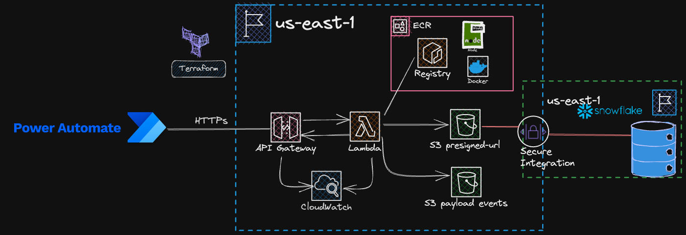

# Data Engineering AWS Lambda presigned URL for S3
Overall, this project offers a serverless solution for securely uploading files to an S3 bucket and enables the integration of event-driven processing in AWS services.

## Description
This project aims to create a serverless infrastructure using Terraform. The infrastructure includes an API Gateway, a Lambda function, and CloudWatch Logs.

The main purpose of the project is to provide a presigned URL retrieval mechanism for uploading files to a private S3 bucket through HTTPs requests. The API Gateway acts as the entry point for these requests, while the Lambda function generates the presigned URL and handles the file upload process. The S3 bucket serves as the storage location for the uploaded files.

This project aims to provision and manage infrastructure resources using Terraform. It provides a convenient way to automate the creation and management of infrastructure components.

Note: This code does not provision an AWS S3 Bucket, for our use case a bucket was already created without using Terraform, therefore, this is not reacreating the resource since S3 buckets are globally available.



## Prerequisites

Before you begin, ensure that you have the following prerequisites installed:

- [Docker](https://www.docker.com/): Latest version if possible
- [Docker-Compose](https://docs.docker.com/compose/): Latest version if possible
- [AWS CLI](https://docs.aws.amazon.com/cli/latest/userguide/cli-configure-files.html): Setup aws credentials.

## Getting Started

Follow the instructions to get the project up and running (This instructins are based on a UNIX OS system), if you are using Windows follow the instructions in the Makefile file:

### 1.- Setup ECR (Elastic Container Registry)

1. Clone the repository : `git clone https://.../lambda-presigned-url.git && cd lambda-presigned-url`
    * Change directory: `cd terraform`
    * Change variables in the `terraform.tfvars` file, make sure you change the name of the `bucket_name` variable.
    * If this is the first time running this project, then initialize terraform: `make tf-init`
    * Create ECR repository: `make tf-apply-ecr`, after running the command the prompt should show the arn and url of the ECR, make sure you copy them since we will need them later.

### 2.- Upload local Docker image to remote Repository (ECR)
1. Change directoy `cd ../getSignedURL`
2. Build the Docker image
    ```
    docker build --no-cache -t de-presigned-url-lambda-image:v1 .
    ```
3. Authenticate Docker to Amazon ECR, before running chage `<region>` & `<account-id>`
    ```
    aws ecr get-login-password --region <region> | docker login --username AWS --password-stdin <account-id>.dkr.ecr.<region>.amazonaws.com
    ```
4. Tag the Docker Image with the ECR Repository URL, change `<account-id>`
    ```
    docker tag de-presigned-url-lambda-image:v1 <account-id>.dkr.ecr.us-east-1.amazonaws.com/de_presigned_url_ecr:v1
    ```
5. Push the Docker Image to ECR, change `<account-id>`
    ```
    docker push <account-id>.dkr.ecr.us-east-1.amazonaws.com/de_presigned_url_ecr:v1
    ```
### 3.- Deploy all the services
1. Change directory to terraform `cd ../terraform`
2. Run
    ```
    make tf-apply
    ```
3. Inside of the `events` folder there is a sample `mapping.csv` file, upload to the root of the S3 bucket with the names of the files you would like lambda to accept and load.

Note: The output should display all the arns and URLs of the services after Terrafor finishes deploying all the services.

## Additional Resources

Here are some additional resources that can help you learn more about Terraform:

- [Terraform Documentation](https://www.terraform.io/docs/index.html): Official documentation for Terraform.
- [Terraform Registry](https://registry.terraform.io/): Browse and search for community-contributed Terraform modules and providers.
- [Terraform GitHub Repository](https://github.com/hashicorp/terraform): Official GitHub repository for Terraform.

## Contributing

If you would like to contribute to this project, please follow contact me.

## License

This project is licensed under the [MIT License](LICENSE).

## Authors
* **Enrique Plata**